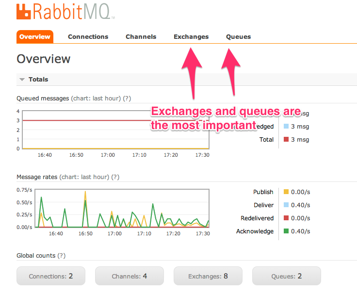
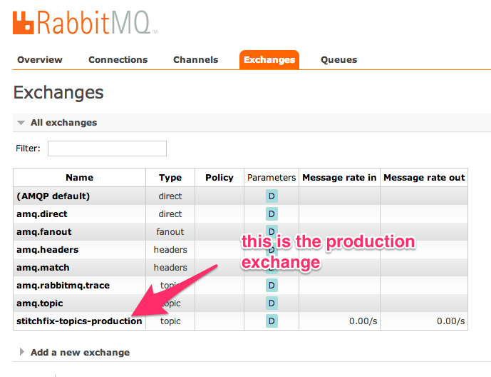

# Pwwka


Pronounced "Poo-ka" |ˈpo͞okə|

[PLACEHOLDER FOR IMG]

---


This gem connects to a topic exchange on a RabbitMQ server. It gives any app using it the ability to do two things:

* Transmit messages to the exchange
* Receive messages from the exchange and tell the exchange whether or not the message has been acknowledged.

Any app can do one or both of these things.

The basic principle of the Pwwka Message Bus is this:

> The transmitter should send messages to inform anyone who listens that an event has occurred. It's up to the receiver to interpret the message.

As an example:

* public_app sends a message that a new client has signed up
* admin_app receives that message and updates its client index
* email_app receives that message and sends a welcome email to the client

### Persistence

All transmitters and receivers share the same exchange. This means that all receivers can read all messages that any transmitter sends. To ensure that all messages are received by eveyone who wants them the Pwwka message bus is configured as follows:

* The exchange is named and durable. If the service goes down and restarts the named exchange will return with the same settings so everyone can reconnect.
* The receiver queues are all named and durable. If the service goes down and restarts the named queue will return with the same settings so everyone can reconnect, and with any unacknowledged messages waiting to be received.
* All messages are sent as persistent and require acknowledgement. They will stick around and wait to be received and acknowledged by every queue that wants them, regardless of service interruptions.


## Setting it up

### Install RabbitMQ locally

```
brew install rabbitmq
```

And follow the instructions.

### Adding it to your app

Add to your `Gemfile`:

```ruby
gem 'pwwka', require: false, git: 'https://github.com/stitchfix/pwwka.git'
```


### Set up your message_handler configration

Connect to your RabbitMQ instance using the url and choose a name for your
topic exchange.

In `config/initializers/pwwka`:

```ruby
require 'pwwka'
Pwwka.configure do |config|
  config.rabbit_mq_host      = ENV['RABBITMQ_URL']
  config.topic_exchange_name = "mycompany-topics-#{Rails.env}"
end
```

## Sending a message

You can send any kind of message using `Pwwka::Transmitter.send_message!`:

```ruby
payload = {client_id: '13452564'}
routing_key	= 'sf.clients.client.created'
Pwwka::Transmitter.send_message!(payload, routing_key)
```
The payload should be a simple hash containing primitives. Don't send objects because the payload will be converted to JSON for sending. This will blow up if an exception is raised. If you want the exception to be rescued and logged, use this instead:

```ruby
Pwwka::Transmitter.send_message_safely(payload, routing_key)
```

You can also use the two convenience methods for sending a message. To include these methods in your class use:

```ruby
include Pwwka::Handling
```

Then you can call:

```ruby
send_message!(payload, routing_key)
```

This method will blow up if something goes wrong. If you want to send safely then use:

```ruby
send_message_safely(payload, routing_key)
```

The messages are not transaction safe so for updates do your best to send them after the transaction commits. You must send create messages after the transaction commits or the receivers will probably not find the persisted records.


## Receiving messages

The message-handler comes with a rake task you can use in your Procfile to start up your message handler worker:

```ruby
message_handler: rake message_handler:receive HANDLER_KLASS=ClientIndexMessageHandler QUEUE_NAME=adminapp_style_index ROUTING_KEY='client.#.updated'
```

* `HANDLER_KLASS` (required) refers to the class you have to write in you app (equivalent to a `job` in Resque)
* `QUEUE_NAME` (required) we must use named queues - see below
* `ROUTING_KEY` (optional) defaults to `#.#` (all messages)

You'll also need to bring the Rake task into your app.  For Rails, you'll need to edit the top-level `Rakefile`:

```ruby
require 'stitch_fix/message_handler/tasks'
```

### Queues - what messages will your queue receive

It depends on your `routing_key`. If you set your routing key to `#.#` (the default) it will receive all the messages. The `#` is a wildcard so if you set it to `client.#` it will receive any message with `client.` at the beginning. The exchange registers the queue's name and routing key so it knows what messages the queue is supposed to receive. A named queue will receive each message it expects to get once and only once.

The available wildcards are as follows
* `*` (star) can substitute for exactly one word.
* `#` (hash) can substitute for zero or more words.

__A note on re-queuing:__ At the moment messages that raise an error on receipt are marked 'not acknowledged, don't resend', and the failure message is logged. All unacknowledged messages will be resent when the worker is restarted. The next iteration of this gem will allow for a specified number of resends without requiring a restart.

__Spinning up some new dynos to handle the load:__ Since each named queue will receive each message only once you can spin up multiple process using the *same named queue* and they will share the messages between them. If you spin up three processes each will receive roughly one third of the messages, but each message will still only be received once.

### Handlers
Handlers are simple classes that must respond to `self.handle!`. The receiver will send the handler three arguments:

* `delivery_info` - [a bunch of stuff](http://rubybunny.info/articles/queues.html#accessing_message_delivery_information)
* `properties` - [a bunch of other stuff](http://rubybunny.info/articles/queues.html#accessing_message_properties_metadata)
* `payload` - the hash sent by the transmitter

Here is an example:

```ruby
class ClientIndexMessageHandler
  
  attr_reader :payload
  def initialize(payload)
    @payload = payload
  end

  def self.handle!(delivery_info, properties, payload)
    # for this handler we only care about the payload
    handler = new(payload) 
    handler.do_a_thing
  end

  def do_a_thing
    ###
    # some stuff that is being done
    ###
  end

end
```

## Monitoring
RabbitMQ has a good API that should make it easy to set up some simple monitoring. In the meantime there is logging and manual monitoring.

### Logging
The receiver logs details of any exception raised in message handling:
```ruby
error "Error Processing Message on #{queue_name} -> #{payload}, #{delivery_info.routing_key}: #{e}"
```
.The transmitter will likewise log an error if you use the `_safely` methods:
```ruby
error "Error Transmitting Message on #{routing_key} -> #{payload}: #{e}"
```

### Manual monitoring
RabbitMQ has a web interface for checking out the health of connections, channels, exchanges and queues. Access it via the Heroku add-ons page for Enigma.





## Testing
The message_handler gem has tests for all its functionality so app testing is best done with expectations. However, if you want to test the message bus end-to-end in your app you can use some helpers in `lib/stitch_fix/message_handler/test_handler.rb`. See the gem specs for examples of how to use them.

## Contributing

We're actively using Pwwka in production here at [Stitch Fix](http://technology.stitchfix.com/) and look forward to seeing Pwwka grow and improve with your help. Contributions are warmly welcomed.

To contribute, 
1. make a fork of the project
2. write some code (with tests please!) 
3. open a Pull Request	
4. bask in the warm fuzzy Open Source hug from us

## TODO
* automated monitoring
* forking
* resending
* handling messages from inside transactions properly
